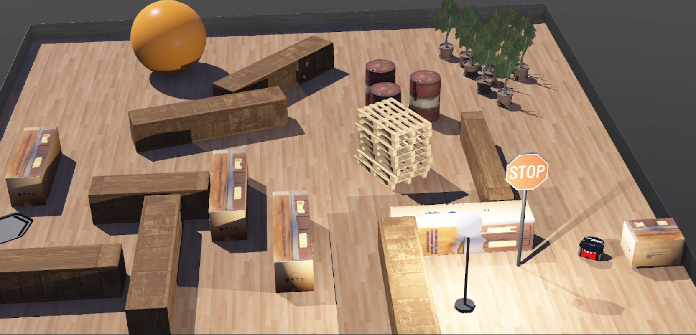

# DESAFIO de ROBÓTICA - 2021

Challenge for volunteers at the Robotics and Autonomous Systems Laboratory, at SENAI CIMATEC, 2021.

The objective of this challenge is to develop an autonomous navigation system, so that the robot can reach the illuminated region of the pre-defined map, avoiding all obstacles on the route within 2 minutes. The simulation was performed using Webots software, which is an open source and multi-platform desktop application used to simulate robots.

the challenge is in the repository: https://github.com/Brazilian-Institute-of-Robotics/desafiorobotica

# Organização

A organização das pastas é a seguinte:

- `resources` - Resources used in the README and video of the simulation.

- `webots_content` - Contains **world**, you can load them inside the Webots simulator.

- `controllers` - Controller used for the challenge

# THE ROBOT

The robot used was the Pioneer 3-DX and he was able to navigate the map avoiding obstacles completing his objective in less than 2 minutes. To accomplish this task, the robot uses its 16 distance sensors and a light sensor was added: a light sensor. The light sensor tracks the local irradiance and sends a signal to the robot when it reads over 750 W/m2, which means it is close enough to the floor lamp.

# COntrole

A navegação do robô pelo mapa é baseada em uma máquina de 4 estados que determinam se ele deve se mover para frente, virar à esquerda, direita ou parar quando chegar ao seu objetivo final. 

# Resultados

The video shows the pioneer arriving at the luminous area and stopping, thus completing the proposed challenge.

**It is the challenges that drive us forward and make us better!**